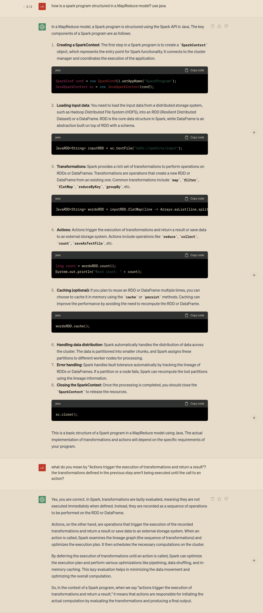

# Reconocimiento de entidades nombradas usando Spark

## Autora:

- Kurtz Lara, lara.kurtz@mi.unc.edu.ar

# Instalación de Spark en una computadora personal

En lugar de instalar Spark a nivel del sistema, opté por agregar las librerías de Spark al proyecto. De esta manera, las librerías pueden ser utilizadas en el código sin necesidad de configurar variables de entorno.

Asumiendo que JDK ya está instalado, seguir los siguientes pasos:

1. Descargar las librerías de Spark desde el sitio de [Apache Spark](<[https://spark.apache.org/downloads.html](https://spark.apache.org/downloads.html)>).
2. Descomprimir el directorio obtenido: `spark-3.4.0-bin-hadoop3` .
3. Extraer los archivos `.jar` del directorio `spark-3.4.0-bin-hadoop3/jars` y colocarlos en el directorio `lib/spark` del proyecto.
4. Configurar el `build path` de la IDE para incluir los `.jar` en las dependencias del programa. Para lograr esto en Visual Studio Code incorporar la siguiente línea al archivo `setting.json`:

   ```json
   {
     "java.project.referencedLibraries": ["lib/*.jar"]
   }
   ```

# Estructura de un programa en Spark

En general, un programa en Spark se estructura como un conjunto de operaciones a realizar sobre Resilient Distributed Datasets (RDDs). Estos programas se dividen en conjuntos de tareas a ser realizadas por nodos en el clúster.

Un RDD (Resilient Distributed Dataset) es una estructura de datos en Spark que representa una colección inmutable y distribuida de objetos. Los RDDs son tolerantes a fallos y permiten realizar operaciones en paralelo.

A continuación, ejemplificamos la estructura de un programa en Spark con el siguiente código, que cuenta la cantidad de ocurrencias de cada palabra en un conjunto de documentos:

```java
package tests;

import org.apache.spark.api.java.JavaRDD;
import org.apache.spark.api.java.JavaSparkContext;

import scala.Tuple2;

import java.util.Arrays;
import java.util.List;

// from chatgpt
public class exampleSpark {
    public static void main(String[] args) {
        // Create a SparkContext
        JavaSparkContext sc = new JavaSparkContext("local[*]", "WordCountSparkApp");

        // Load the input text file
        JavaRDD<String> lines = sc.textFile("tests/input/*.txt");

        // Perform word count using MapReduce model
        JavaRDD<Tuple2<String, Integer>> wordCounts = lines
                .flatMap(line -> Arrays.asList(line.split(" ")).iterator())
                .mapToPair(word -> new Tuple2<>(word, 1))
                .reduceByKey((count1, count2) -> count1 + count2)
                .map(tuple -> new Tuple2<>(tuple._1(), tuple._2()));

        // collect the partial results from the workers
        List<Tuple2<String, Integer>> wordCountList = wordCounts.collect();

        // print the results
        for (Tuple2<String, Integer> wordCount : wordCountList) {
            System.out.println(wordCount._1() + ": " + wordCount._2());
        }

        // Stop the SparkContext
        sc.stop();
        // close the spark context
        sc.close();
    }
}
```

Podemos identificar las siguientes partes:

1. **Creación de un `SparkContext`** para inicializar el framework de Spark y establecer la comunicación con el cluster.

   En este caso, se crea un `JavaSparkContext` con el argumento `"loca[*]"` que indica que se utilizarán todos los procesadores disponibles en la máquina local. El segundo argumento define un nombre para el programa, que se mostrará en la salida estándar de Spark.

   ```java
   // Create a SparkContext
           JavaSparkContext sc = new JavaSparkContext("local[*]", "WordCountSparkApp");
   ```

2. **Carga de datos** en RDDs para su procesamiento. Esto permite que los datos sean distribuidos y procesados en paralelo.

   En este caso, se cargan todos los archivos de texto especificados en un RDD llamado `lines`.

   ```java
    // Load the input text file
           JavaRDD<String> lines = sc.textFile("tests/input/*.txt");
   ```

3. **Transformaciones** sobre los RDDs. Las transformaciones son operaciones que se aplican a los RDDs para realizar cálculos o preparar los datos para el procesamiento.

   En este caso se realizan varias transformaciones, como `flatMap`, `mapToPair` y `reduceByKey`, que en conjunto obtienen para cada palabra una tupla de la forma `(<word>,<word_frequency>)`.

   ```java
   // Perform word count using MapReduce model
           JavaRDD<Tuple2<String, Integer>> wordCounts = lines
                   .flatMap(line -> Arrays.asList(line.split(" ")).iterator())
                   .mapToPair(word -> new Tuple2<>(word, 1))
                   .reduceByKey((count1, count2) -> count1 + count2)
                   .map(tuple -> new Tuple2<>(tuple._1(), tuple._2()));
   ```

4. **Acciones**. Las acciones son operaciones que disparan la ejecución del programa de Spark y computan los resultados.

   En este caso, se utiliza la acción `collect` para recolectar los resultados parciales de los trabajadores y se imprime el resultado final.

   ```java
           // collect the partial results from the workers
           List<Tuple2<String, Integer>> wordCountList = wordCounts.collect();
   ```

5. **Cierre y terminación del Sparkcontext** para terminar todos los trabajos y liberar los recursos utilizados.

   ```java
           // Stop the SparkContext
           sc.stop();
           // close the spark context
           sc.close();
   ```

# Adaptación del código del Laboratorio 2 a la estructura del programa objetivo en Spark

Para adaptar el código del laboratorio 2 a Spark, realicé las siguientes modificaciones. En primer lugar, separé el filtrado y conteo de las entidades nombradas de la instanciación de las clases correspondientes. Para lograr esto, realicé cambios en las clases para evitar que las frecuencias globales se incrementen con cada instancia. En su lugar, pasé la frecuencia correspondiente a cada instancia como un parámetro al constructor de la clase. Esto se debe a que el conteo de frecuencias se realiza antes de la instanciación, como parte de las transformaciones aplicadas al dataset pasado a Spark.

A continuación, se muestra el código relacionado con la carga de datos y la definición de transformaciones:

## Carga de datos

```java
// Create a SparkContext
			JavaSparkContext sc = new JavaSparkContext("local[*]", "ArticleProcessing");

			// Load the articles into RDDs
			JavaRDD<Article> articles = sc.parallelize(allArticles);
```

Los datos se cargan en un RDD. En este caso, los datos que se distribuyen son artículos. Cada nodo de Spark procesará uno o más artículos. La lista allArticles contiene todos los artículos de todos los feeds. El método `parallelize()` se utiliza para crear un RDD a partir de la lista de artículos.

## Transformaciones

```java
JavaRDD<Tuple2<String, Integer>> words = articles
                .flatMap(article -> Arrays.asList(article.getContent().split("\\s+")).iterator())
                .map(str -> cleanString(str))
                .filter(str -> isWord(str))
                .filter(word -> heuristic.isEntity(word))
                .mapToPair(ne -> new Tuple2<>(ne, 1))
                .reduceByKey((count1, count2) -> count1 + count2)
                .map(tuple -> new Tuple2<>(tuple._1(), tuple._2()));

```

Se definen las transformaciones que se aplican a los datos:

1. Se obtiene el contenido de cada artículo y se divide en strings individuales, separados por uno o más espacios en el texto.

2. Se aplica el método `cleanString()` a cada string obtenido para eliminar caracteres especiales.

3. Se filtran los strings para obtener solo las palabras, utilizando el método `isWord()` que filtra los strings alfanuméricos.

4. Se aplica el método `isEntity()` a cada palabra para filtrar las entidades nombradas utilizando la heurística especificada.

5. Se mapea cada entidad nombrada a una tupla de la forma `(word, 1)`.

6. Se agrupan los elementos que tienen la misma clave y se les aplica una función de reducción para obtener la frecuencia total de cada entidad nombrada.

7. Se transforma cada elemento del JavaPairRDD en una tupla con los mismos valores, obteniendo un `JavaRDD<Tuple2<String, Integer>>` en el que se especifican los tipos de los elementos de la tupla.

## Acciones

```java
// collect all partial results
			List<Tuple2<String, Integer>> result = words.collect();
```

Se utiliza la acción `collect()` para recolectar los resultados parciales de las transformaciones realizadas en cada nodo del RDD. Esta acción desencadena la ejecución de las transformaciones y acciones definidas previamente en el RDD. Spark distribuye los cálculos en el clúster, ejecutando las operaciones correspondientes en cada partición y recopilando los resultados en el programa coordinador (driver).

Se utiliza esta acción para obtener una lista de tuplas, de la cual se extraen los parámetros necesarios y se llama al constructor de las clases mediante el método `generateNamedEntity()` de la clase NamedEntity.

## Ejemplo de ejecución

```java
************* FeedReader version 1.0 *************

Found 1299 occurrences of named entities

Total occurrences by category
	Other: 1116
	Organization: 57
	Place: 45
	Name: 30
	Lastname: 24
	Title: 10
	Country: 8
	City: 5
	CDate: 3
	Event: 1
	Address: 0
	Product: 0

Total occurrences by topic
	Other: 767
	Politics: 103
	National: 63
	International: 40
	Sports: 30
	Tennis: 4
	Futbol: 0
	Music: 0
	Basket: 0
	F1: 0
	Cine: 0

"OpenAI" occurs in:
	Category "Organization": 3 of 57 times
	Topic    "International": 3 of 40 times

"NBA" occurs in:
	Category "Other": 4 of 1116 times
	Topic    "Sports": 4 of 30 times

"President" occurs in:
	Category "Title": 2 of 10 times
	Topic    "National": 2 of 63 times
```

# Cómo se integra una estructura orientada a objetos con la estructura funcional de map-reduce

La integración de una estructura orientada a objetos con la estructura funcional de map-reduce se logra utilizando librerías que permiten combinar ambas metodologías. En este caso, empleamos la librería _Spark_ en el lenguaje orientado a objetos _Java_.

**La programación orientada a objetos se utiliza para modelar el problema, abstraer conceptos y representar las entidades nombradas**. Esta metodología nos permite diseñar clases y objetos que encapsulan los datos y el comportamiento relacionado con el problema que queremos resolver.

Por otro lado, **la programación funcional se utiliza para realizar operaciones de transformación y análisis de datos de manera declarativa y sin efectos secundarios**. En lugar de modificar los datos existentes, se aplican funciones puras que toman un conjunto de datos y devuelven un nuevo resultado. El paradigma funcional se basa en la composición de funciones y en la inmutabilidad de los datos. En Spark, esto se traduce en aplicar transformaciones sobre RDDs, donde cada transformación genera un nuevo RDD con las modificaciones especificadas.

Esta combinación nos permite aprovechar lo mejor de ambos enfoques: la claridad y el modelado de la programación orientada a objetos, junto con la capacidad de procesamiento distribuido y paralelismo ofrecidos por la estructura funcional de map-reduce.

# **Utilización de inteligencias artificiales en el proceso de desarrollo**

He utilizado varias inteligencias artificiales (IA) en el proceso de desarrollo, algunas de propósito general, como _Bard_ y _ChatGPT-3_, así como especializadas en desarrollo de código, como _Copilot_. Estas tres IAs resultan ser muy útiles, aunque algunas son más adecuadas para ciertos tipos de consultas que otras.

Sin embargo, es importante tener en cuenta que no se puede depender totalmente de las IAs, ya que tienden a generar contenido incorrecto y/o ambiguo. Por lo tanto, es necesario verificar lo que devuelven.

He incorporado el uso de inteligencias artificiales en casi todo mi proceso de desarrollo, pero particularmente en las siguientes áreas:

## Generación y comprensión de código

Para este caso usé las tres IAs, aunque con leves diferencias en los casos de uso para cada una.

_Copilot_ resulta muy útil para obtener rápidamente código simple, evitando tener que escribirlo manualmente, como por ejemplo en el caso de los getters y setters para cada clase. También es útil para familiarizarse con la sintaxis del lenguaje e incluso obtener ideas sobre posibles métodos a utilizar.

En general, utilizo _Copilot_ en situaciones muy específicas, ya que las sugerencias que ofrece a menudo interrumpen mi proceso de pensamiento al resolver un problema.

Por otro lado, cuando se trata de generar código más complejo, encuentro que no quedo conforme con las propuestas de _Copilot_. En estos casos, prefiero utilizar IAs con las que pueda interactuar y hacer preguntas para no solo obtener código funcional, sino también comprenderlo.[1]

Por ejemplo, el programa de `wordcount` que utilizo para ejemplificar la estructura de un programa en Spark fue generado por _ChatGPT_, al mismo tiempo que lo utilizaba para hacer preguntas y comprender el código. [2]

_Bard_ también es muy útil para la generación y comprensión de código en ciertos casos, ya que ofrece respuestas más concisas y divide el código en partes pequeñas, explicando y haciendo referencia a cada una. Sin embargo, una gran desventaja de _Bard_ es que no guarda las conversaciones anteriores, por lo que se pierden las interacciones cada vez que se recarga la página. [3]

## Debugging

En general, las IAs son útiles para solucionar problemas en el código a partir de mensajes de error o excepciones, ya que ofrecen ideas sobre las posibles causas de estos problemas. Aunque no siempre son suficientes, suelen ser una buena herramienta para orientarse en la dirección correcta.

## Generación de entradas para el diccionario

Para la clasificación de las entidades nombradas, utilizamos un diccionario que asigna una clasificación y un tema a cada entidad, siguiendo las jerarquías propuestas en el enunciado. Cuantas más entradas tenga el diccionario, mejor será su capacidad de clasificación.

Para ampliar el diccionario, he utilizado tanto _Bard_ como _ChatGPT_, proporcionándoles el diccionario actual como ejemplo de su estructura, los posibles valores para cada categoría y tema, y algunas indicaciones generales. En este caso, he notado que _ChatGPT_ produce mejores resultados y es más conveniente debido a que no se pierden las conversaciones. En general, ambas IA generan buenas entradas cuando se les solicitan temas específicos, pero llega un punto en el que se estancan y producen contenido que no cumple con las indicaciones proporcionadas.

También les proporcioné la lista de entidades nombradas obtenida mediante nuestro programa, solicitándoles que filtraran aún más las entidades nombradas y las clasificaran. De esta manera, obtuvimos resultados más representativos de las entidades que podríamos encontrar en los feeds configurados.

Además, intenté utilizar las IAs para filtrar entradas inválidas en los diccionarios, pero no resultaron muy útiles, ya que terminaban eliminando entradas válidas o generando nuevas entradas incorrectas.

# Imágenes referenciadas

[1] Uso para comprensión de código referido a la estructura de un programa en java spark


[2]. Uso para comprensión de código del programa `Wordcount`


[3]. Ejemplo de generación de código usando bard

